# Wazuh SIEM Docker Lab

A fully containerised Wazuh 4.9.0 SIEM stack running on Docker Desktop (Windows + WSL2 backend). I built this to get hands-on with log ingestion, agent enrollment, and real alert detection — starting from zero and ending with a live brute-force attack showing up in the dashboard.

---

## What's in here

| File / Folder | Purpose |
|---|---|
| `docker-compose.yml` | The three-container Wazuh stack (manager, indexer, dashboard) |
| `generate-indexer-certs.yml` | One-shot cert generator — run once before `up` |
| `agent.yml` | The `target-ubuntu` attack target (Ubuntu 22.04 + Wazuh agent + sshd) |
| `config/` | Wazuh config files; SSL certs are generated locally and gitignored |
| `docs/` | Documentation and Docker learning playbook |

---

## Architecture

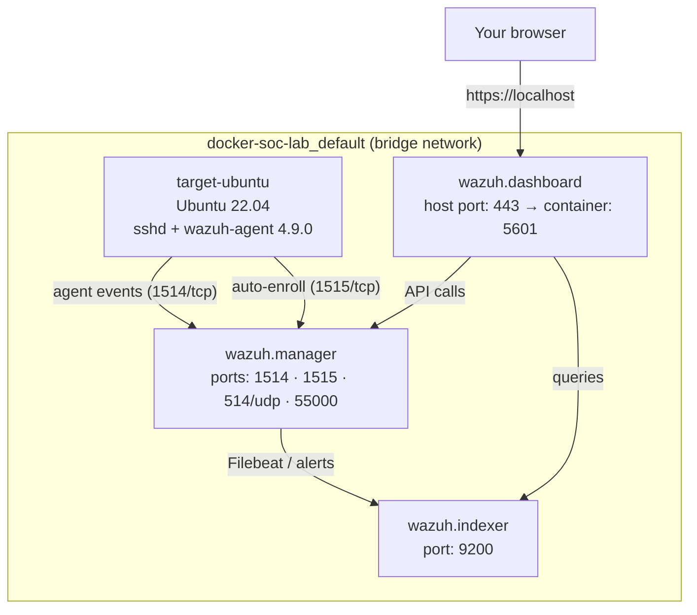

Four containers, one shared bridge network, one command to bring it up.

---

## Prerequisites

- **Docker Desktop** (Windows) with the WSL2 backend enabled
- **~16 GB RAM** recommended — the indexer (OpenSearch under the hood) is memory-hungry
- **Git** for cloning

---

## Setup walkthrough

### 1 — Set `vm.max_map_count`

The Wazuh indexer is built on OpenSearch, which requires the Linux kernel to allow far more virtual memory mappings than the default. On Windows, Docker runs inside a WSL2 VM — so you set it inside that VM:

```powershell
wsl -d docker-desktop sysctl -w vm.max_map_count=262144
```

You should see `vm.max_map_count = 262144` echoed back.

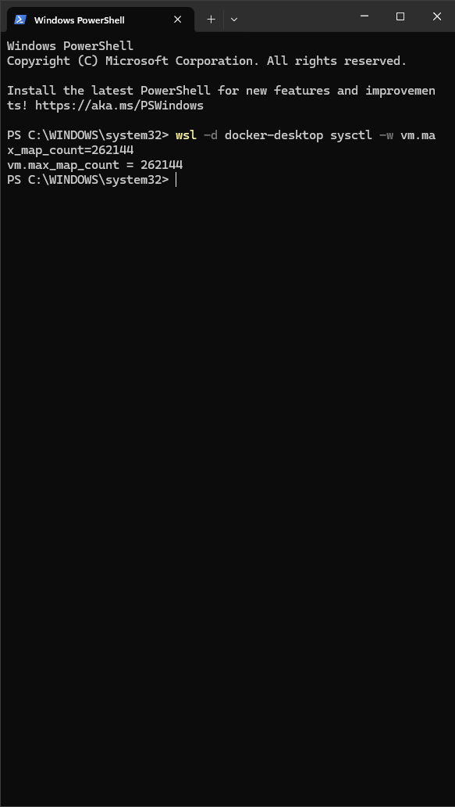

> **Heads up:** this setting resets every time Docker Desktop restarts. If the indexer container ever exits with code 137 or refuses to start, this is almost always why — just re-run the command.

---

### 2 — Clone the Wazuh Docker repo and pull the single-node config

```powershell
git clone https://github.com/wazuh/wazuh-docker.git -b v4.9.0
cp -r wazuh-docker\single-node\* .
```

`single-node` is the lightweight full-stack config — one manager, one indexer, one dashboard, one of each. Perfect for a lab on 16 GB. The `cp` flattens its contents into your repo root so you own the files directly.

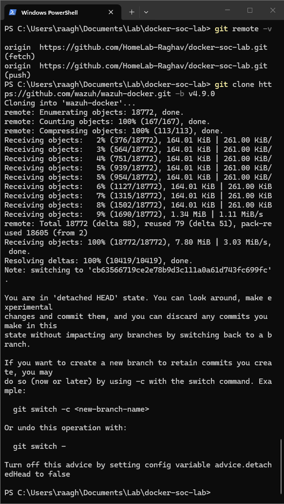

Once copied, clean up the temporary clone and commit:

```powershell
Remove-Item -Recurse -Force wazuh-docker
git add .
git commit -m "Add Wazuh single-node docker-compose foundation"
git push
```

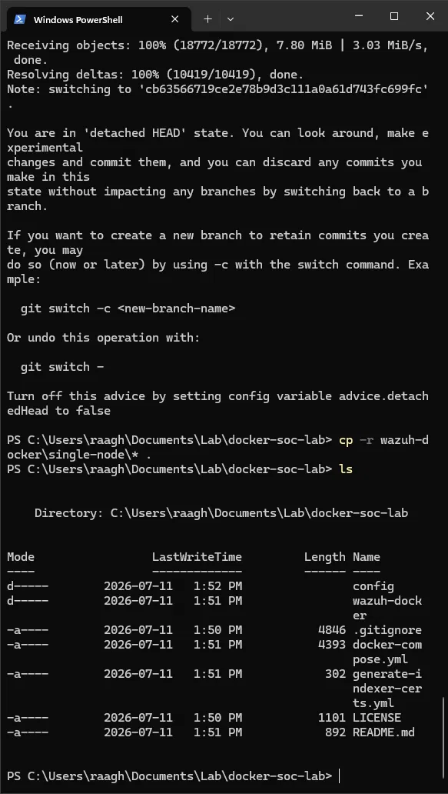

---

### 3 — Understand the compose file

`docker-compose.yml` defines three services. The key things to know about each:

**`wazuh.manager`** — the detection brain. It runs the Wazuh ruleset, processes events from every agent, and fires alerts. Listens on:
- `1514` — agent event/log shipping
- `1515` — agent auto-enrollment (authd)
- `55000` — REST API

**`wazuh.indexer`** — the storage and search engine (OpenSearch). Every alert the manager produces gets indexed here. This is the one that needs `vm.max_map_count`.

**`wazuh.dashboard`** — the Kibana-style web UI you'll actually use day-to-day:

```yaml
ports:
  - 443:5601           # host:container — reach it at https://localhost
environment:
  - INDEXER_USERNAME=admin
  - INDEXER_PASSWORD=SecretPassword
  - DASHBOARD_USERNAME=kibanaserver
  - DASHBOARD_PASSWORD=kibanaserver
depends_on:
  - wazuh.indexer      # won't start until the indexer is up
```

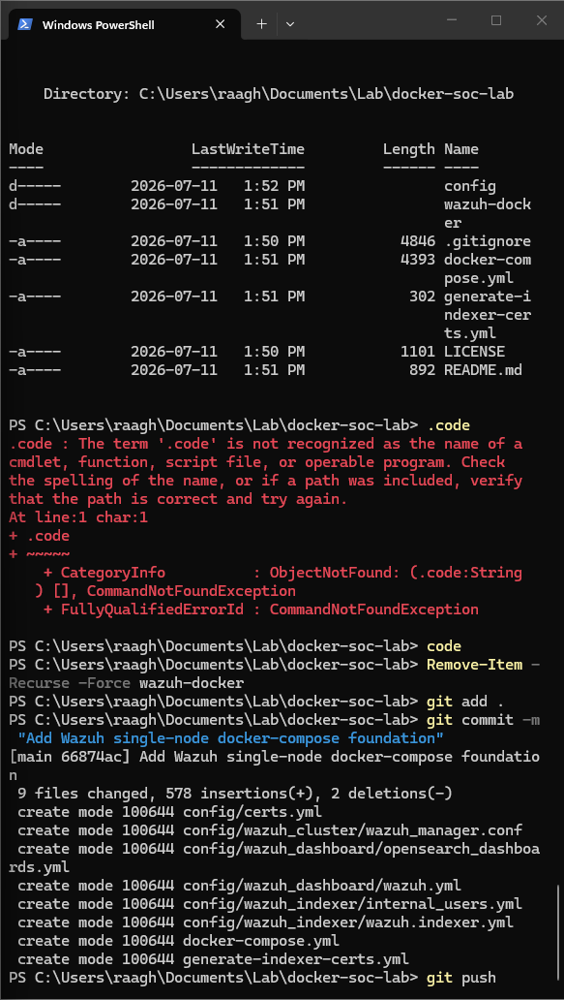

The **named volumes** at the bottom of the file are why your alerts and config survive a `docker-compose down`:

```yaml
volumes:
  wazuh_etc:
  wazuh_logs:
  wazuh_queue:
  wazuh-indexer-data:
  # ... and more
```

Docker manages these on the host. The containers are disposable; the data in the volumes isn't.

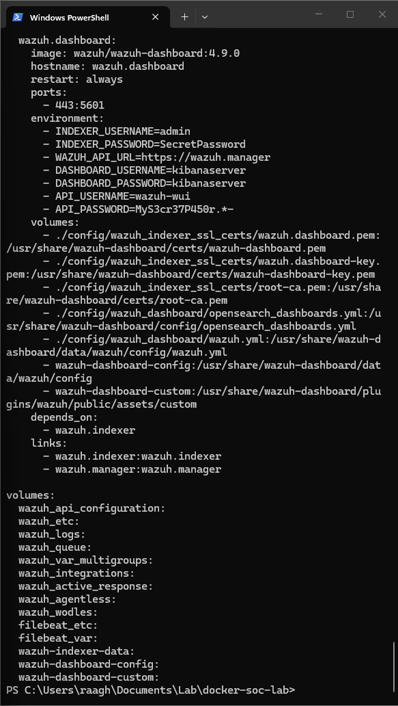

---

### 4 — Generate SSL certificates

The entire Wazuh stack uses mutual TLS. Before the first `up`, generate all certs with a one-shot container:

```powershell
docker-compose -f generate-indexer-certs.yml run --rm generator
```

`-f` tells compose to use the cert-gen file instead of the main one. It spins up `wazuh/wazuh-certs-generator:0.0.2`, which creates a root CA plus per-service certificates, drops them all into `config/wazuh_indexer_ssl_certs/`, then the `--rm` flag deletes the container automatically when done.

On first run it'll pull the generator image:

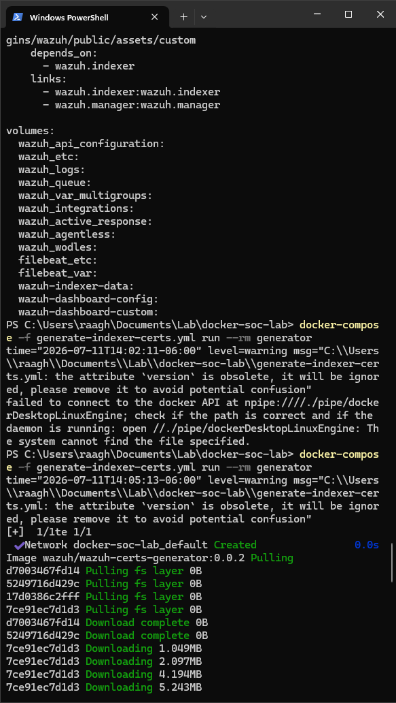

When it finishes you'll see lines like `INFO: Wazuh dashboard certificates created.` and then you're back at the prompt:

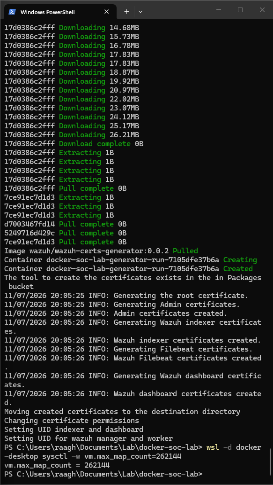

This is a one-time step. The certs are gitignored — if you clone the repo fresh you need to re-run this before `up`.

---

### 5 — Start the stack

```powershell
docker-compose up -d
```

On first run Docker pulls the three Wazuh images (~500 MB total), creates all the named volumes, and starts the containers. All three should show `Started`:

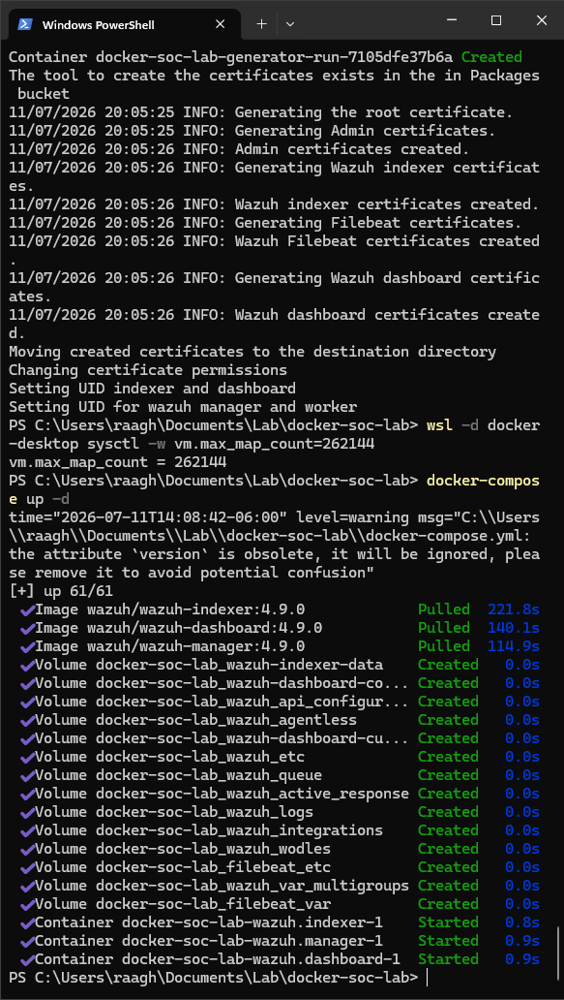

Give it **60–90 seconds** after that for the indexer to initialise and the dashboard to connect to it before opening the browser.

---

### 6 — Access the dashboard

Open **`https://localhost`** in your browser. Accept the self-signed certificate warning — this is expected, these are the locally generated certs.

Login: **`admin` / `SecretPassword`**

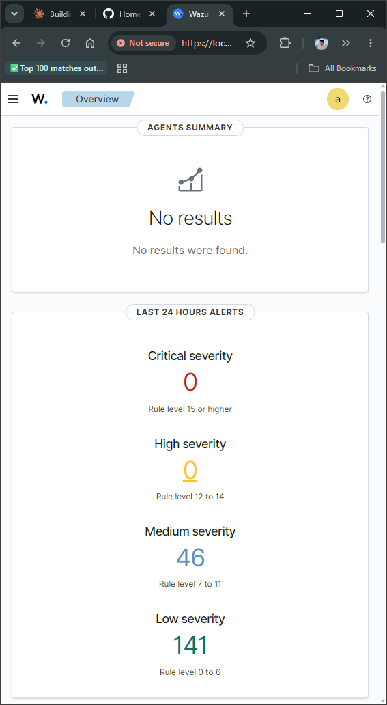

You're in. No agents connected yet, so Agents Summary shows nothing and alert counts are zero. That changes in the next step.

---

### 7 — Deploy the target agent (`target-ubuntu`)

`agent.yml` defines a second compose project: an Ubuntu 22.04 container that installs OpenSSH and the Wazuh agent at startup, auto-enrolls with the manager over port 1515, and stays alive running `sshd -D`.

```powershell
docker-compose -f agent.yml up -d
```

It joins the existing `docker-soc-lab_default` network so it can reach `wazuh.manager` by hostname.

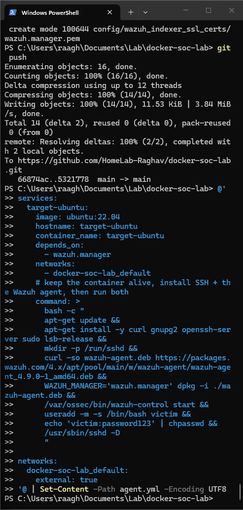

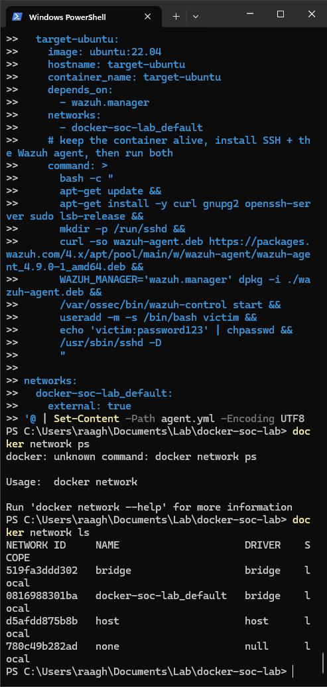

**Verify it enrolled** — give it ~60 seconds for the agent installer to finish, then:

```powershell
# On the agent: look for "Connected to the server"
docker exec target-ubuntu sh -c "tail -20 /var/ossec/logs/ossec.log"

# On the manager: confirm it shows Active
docker exec docker-soc-lab-wazuh.manager-1 /var/ossec/bin/agent_control -l
```

Expected output from `agent_control -l`:
```
ID: 004, Name: target-ubuntu, IP: any, Active
```

The agent also appears in the dashboard under **Agents**.

> If you see `ERROR: Duplicate agent name: target-ubuntu` in the agent log, check the troubleshooting guide: [docs/docker-playbook/06-troubleshooting.md](docs/docker-playbook/06-troubleshooting.md)

---

## Attack and detection

### SSH brute force against `target-ubuntu`

The target has a user `victim` with password `password123`. A burst of failed SSH logins triggers Wazuh's brute-force detection rules.

First, get the target's IP on the Docker network:

```powershell
docker inspect target-ubuntu --format "{{.NetworkSettings.Networks.docker-soc-lab_default.IPAddress}}"
```

Then run failed logins (from another container on the same network, or from WSL):

```bash
# Quick manual burst — 10 bad attempts
for i in $(seq 1 10); do
  sshpass -p wrongpassword ssh -o StrictHostKeyChecking=no \
    -o ConnectTimeout=2 victim@<TARGET_IP> 2>/dev/null || true
done
```

Or use `hydra` from a Kali container attached to the same network:

```bash
hydra -l victim -P /usr/share/wordlists/rockyou.txt -t 4 ssh://<TARGET_IP>
```

### See the alerts

In the dashboard: **Security Events** → filter by `agent.name: target-ubuntu`

Within seconds you should see:

| Rule ID | Description |
|---|---|
| 5710 | sshd: Attempt to login using a non-existent user |
| 5712 | sshd: brute force trying to get access to the system |

Watch the raw alert stream directly:

```powershell
docker exec docker-soc-lab-wazuh.manager-1 sh -c "tail -f /var/ossec/logs/alerts/alerts.json"
```

---

## Day-to-day commands

```powershell
# Start / stop the Wazuh stack
docker-compose up -d
docker-compose down

# Start / stop just the agent target
docker-compose -f agent.yml up -d
docker-compose -f agent.yml down

# Tail agent logs
docker exec target-ubuntu sh -c "tail -f /var/ossec/logs/ossec.log"

# Tail manager alerts (raw JSON)
docker exec docker-soc-lab-wazuh.manager-1 sh -c "tail -f /var/ossec/logs/alerts/alerts.json"

# List registered agents on the manager
docker exec docker-soc-lab-wazuh.manager-1 /var/ossec/bin/agent_control -l

# Check all container status at a glance
docker ps --format "table {{.Names}}\t{{.Status}}\t{{.Ports}}"
```

---

## Security hygiene

> **This is a local learning lab. Default credentials are intentional.**

The following files are gitignored and **must be regenerated locally** before first use (step 4 above):

```
config/wazuh_indexer_ssl_certs/   # generated TLS certs and keys
*.pem
*.key
```

If you clone this repo fresh, run the cert generator before `docker-compose up` or the stack will refuse to start with TLS handshake errors.

The credentials in `docker-compose.yml` (`SecretPassword`, `kibanaserver`, `MyS3cr37P450r.*-`) are Wazuh's shipped demo values and are public knowledge. Never use them outside an isolated lab network.

---

## Stack versions

| Component | Version |
|---|---|
| Wazuh Manager | 4.9.0 |
| Wazuh Indexer (OpenSearch) | 4.9.0 |
| Wazuh Dashboard | 4.9.0 |
| Wazuh Agent (target-ubuntu) | 4.9.0 |
| target-ubuntu base image | ubuntu:22.04 |

---

## Docker learning playbook

I wrote a hands-on Docker reference based on what I actually ran building this lab:
[docs/docker-playbook/README.md](docs/docker-playbook/README.md)
