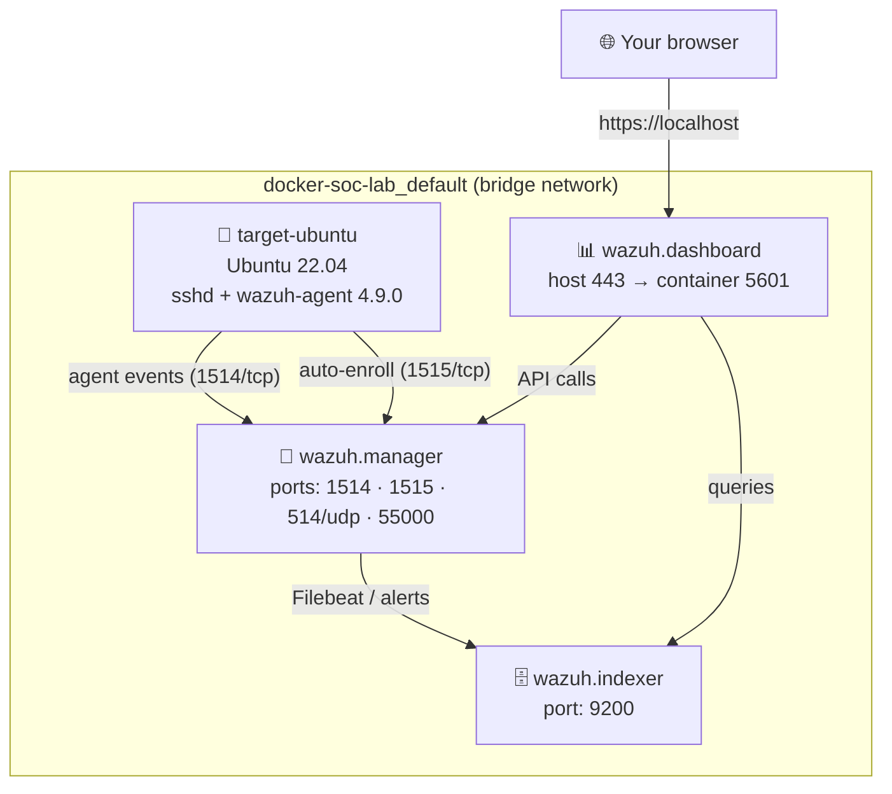

<div align="center">

# 🛡️ docker-soc-lab

### A containerised Wazuh 4.9.0 SIEM stack — from empty folder to a live, detected brute-force attack

*Stand up a full SOC detection pipeline in Docker, launch a real SSH brute-force against a monitored host, and watch every packet of it surface in the dashboard — correctly classified, MITRE-mapped, and compliance-tagged, out of the box.*

<br/>


</div>

---

## 📖 Table of Contents

- [What is this?](#-what-is-this)
- [Highlights](#-highlights)
- [Architecture](#-architecture)
- [Repository layout](#-repository-layout)
- [The stack](#-the-stack)
- [Prerequisites](#-prerequisites)
- [Quick start](#-quick-start)
- [Setup walkthrough (with screenshots)](#-setup-walkthrough-with-screenshots)
- [The Hydra brute-force lab](#-the-hydra-brute-force-lab)
- [What the SIEM caught](#-what-the-siem-caught)
- [Attack timeline](#-attack-timeline)
- [MITRE ATT&CK mapping](#-mitre-attck-mapping)
- [Key finding & remediation](#-key-finding--remediation)
- [Documentation index](#-documentation-index)
- [Day-to-day commands](#-day-to-day-commands)
- [Security hygiene](#-security-hygiene)
- [Skills demonstrated](#-skills-demonstrated)
- [License](#-license)

---

## 🎯 What is this?

`docker-soc-lab` is a **self-contained blue-team detection lab** that runs entirely on Docker Desktop (Windows + WSL2 backend). It brings up a complete **Wazuh 4.9.0 SIEM** — manager, indexer, and dashboard — plus a monitored Ubuntu target, then documents a full **attack → detection → incident response** cycle end to end.

The project isn't just *"here's a docker-compose file."* It's the whole story: standing up the pipeline from zero, enrolling an agent, launching a **real THC-Hydra SSH brute-force** from a disposable Kali container, and then reading the resulting alerts back out of the dashboard — correctly decoded from raw `sshd`/PAM logs, automatically mapped to **MITRE ATT&CK** and **PCI DSS**, and written up as a formal **incident response report**.

> Built by **Raghav Mahajan** as a hands-on SOC Analyst portfolio project — CompTIA Security+ · ISC2 CC · working toward SC-200.

---

## ✨ Highlights

| | |
|---|---|
| 🐳 **One-command SIEM** | Four containers, one shared bridge network, brought up with two `docker-compose` calls |
| ⚔️ **Real attack, real detection** | Live Hydra SSH brute-force — not a simulation or a replayed log file |
| 🔍 **End-to-end pipeline validated** | Raw `auth.log` → agent → manager → indexer → dashboard, with zero custom rules needed |
| 🎯 **Auto MITRE + PCI mapping** | Same alerts classified against threat-modeling *and* compliance frameworks simultaneously |
| 📋 **Formal IR report** | A full [incident response write-up](hydra-lab/incident-response/hydra-lab-1-report.md) with timeline, findings, and remediation |
| 🧠 **A genuine finding** | The lab surfaces *why* the default ruleset didn't raise a single "brute force" correlation alert — and how to fix it |
| 📚 **Docker learning playbook** | Six-chapter Docker reference written from the commands actually used to build this |

---

## 🏗️ Architecture

Four containers, one shared bridge network, one command to bring it up.



**Data flow in one sentence:** the target's `sshd`/PAM logs are tailed by the Wazuh agent, shipped encrypted to the manager on `1514`, decoded and rule-matched there, forwarded via Filebeat into the OpenSearch-based indexer, and rendered as searchable alerts in the dashboard.

---

## 📂 Repository layout

```
docker-soc-lab/
├── docker-compose.yml            # The 3-container Wazuh SIEM stack
├── generate-indexer-certs.yml    # One-shot TLS cert generator (run once, before up)
├── agent.yml                     # The target-ubuntu monitored host (Ubuntu 22.04 + agent + sshd)
│
├── config/                       # Wazuh config (SSL certs generated locally & gitignored)
│   ├── wazuh_cluster/            #   manager config (ossec.conf)
│   ├── wazuh_indexer/            #   indexer + internal users
│   └── wazuh_dashboard/          #   dashboard + opensearch dashboards config
│
├── setup/
│   └── docker-env-setup.md       # ⭐ Full build walkthrough, start to finish
│
├── hydra-lab/                    # The attack + detection exercise
│   ├── trigger.md                #   Visual, scene-by-scene walkthrough of the attack
│   ├── incident-response/
│   │   └── hydra-lab-1-report.md #   📋 Formal IR report (timeline, findings, remediation)
│   └── images/                   #   Dashboard + attack screenshots
│
├── technologies-used/            # Reference notes on each tool/technique
│   ├── wazuh.md · hydra.md · ssh.md · rsyslog.md
│   ├── mitre-attack.md · wazuh-query-language.md
│
└── docker-playbook/              # 📚 Hands-on Docker reference (6 chapters)
    ├── 01-what-is-docker.md → 06-troubleshooting.md
    └── DOCKER_EXPLAINED.md
```

---

## 🧱 The stack

| Component | Image | Version | Role | Ports |
|---|---|---|---|---|
| **Wazuh Manager** | `wazuh/wazuh-manager` | 4.9.0 | Rules engine (`analysisd`), agent enrollment, alert generation | `1514`, `1515`, `514/udp`, `55000` |
| **Wazuh Indexer** | `wazuh/wazuh-indexer` | 4.9.0 | OpenSearch-based alert storage & search | `9200` |
| **Wazuh Dashboard** | `wazuh/wazuh-dashboard` | 4.9.0 | Web UI — Threat Hunting, MITRE, compliance | `443` → `5601` |
| **target-ubuntu** | `ubuntu:22.04` | — | Monitored host: `sshd` + `rsyslog` + Wazuh agent | (internal `22`) |

---

## ✅ Prerequisites

- **Docker Desktop** (Windows) with the **WSL2 backend** enabled
- **~16 GB RAM** recommended — the indexer (OpenSearch under the hood) is memory-hungry
- **Git** for cloning

---

## 🚀 Quick start

```powershell
# 0 — Let the indexer allocate enough virtual memory (resets on every Docker restart)
wsl -d docker-desktop sysctl -w vm.max_map_count=262144

# 1 — Generate the TLS certs the stack needs (one time, gitignored output)
docker-compose -f generate-indexer-certs.yml run --rm generator

# 2 — Bring up the SIEM (manager + indexer + dashboard)
docker-compose up -d

# 3 — Bring up the monitored target
docker-compose -f agent.yml up -d

# 4 — Confirm the agent actually enrolled (not just "container running")
docker exec docker-soc-lab-wazuh.manager-1 /var/ossec/bin/agent_control -l
```

Then open **`https://localhost`** → log in → you're in the Wazuh dashboard.

> 📖 Full step-by-step with explanations and screenshots: **[`setup/docker-env-setup.md`](setup/docker-env-setup.md)**

---

## 🖼️ Setup walkthrough (with screenshots)

The complete build is documented image-by-image in [`setup/docker-env-setup.md`](setup/docker-env-setup.md). A few key moments:

**1. Set `vm.max_map_count` (the #1 cause of a failing indexer):**


> ⚠️ This resets every time Docker Desktop restarts. If the indexer exits with **code 137** or refuses to start, this is almost always why — just re-run it.

**2. Certificate generation completes:**


**3. The stack comes up green:**


**4. The dashboard, live in the browser:**


---

## ⚔️ The Hydra brute-force lab

With the SIEM live, a **disposable Kali container** is launched on the *same* Docker network as the target — so it can reach `target-ubuntu` by hostname, exactly like a real machine on the same subnet.

**Scene 1 — stand up and confirm the lab:**


**Scene 2 — the attack itself.** Three commands tell the whole story:

```bash
apt-get update && apt-get install -y hydra
printf 'admin\n123456\npassword\nletmein\nqwerty\nroot\ntoor\npassword123\n' > pwlist.txt
hydra -l victim -P pwlist.txt target-ubuntu ssh -t 4
```

An 8-line wordlist mixes classic weak passwords with the real one (`password123`) tucked at the end — guaranteeing a hit so there's something real to detect. `-t 4` runs four parallel connections; no stop-on-success flag was used (which matters later).


> 📖 The full, chronological, screenshot-by-screenshot narrative lives in **[`hydra-lab/trigger.md`](hydra-lab/trigger.md)**.

---

## 🔍 What the SIEM caught

Opening **Threat Hunting** for `target-ubuntu`, the attack is visible immediately — no searching required:


- **20 total alerts** · **11 authentication failures** · **2 authentication successes**
- The time-series charts show **one sharp vertical spike** — the visual signature of automated, scripted brute-forcing vs. a human typing passwords one at a time
- The `Top 5 rule groups` donut: `syslog`, `authentication_failed`, `sshd`, `pam`, `ossec` — both the SSH daemon **and** Linux PAM independently logged the attack

**Reading the raw alert stream** turns it into a timeline you can reconstruct the whole attack from:


You can even see the subtle detail that **Hydra kept attacking after it already won** — because no stop-on-success flag was passed, extra `5760` failures appear *after* the successful login.

**Zooming out — MITRE ATT&CK + compliance, generated automatically:**


The same alerts are sliced three ways at once — **MITRE tactics** (Credential Access `11`, Lateral Movement `8`), **PCI DSS** control evidence, and a background **CIS benchmark score of 42%**:


> **This is what makes a SIEM different from a plain log aggregator:** one raw event, automatically classified against multiple frameworks, with zero manual mapping by the analyst.

---

## ⏱️ Attack timeline

Reconstructed from Wazuh alert timestamps — the whole thing lasted **~6.5 seconds**, credential found ~4 seconds in:

| Time (UTC) | Event | Rule ID | Level |
|---|---|---|---|
| 13:33:24 | SCA summary: CIS score < 50% (42%) | `19004` | 7 |
| 13:37:41 | PAM: user login failed ×4 (parallel batch) | `5503` | 5 |
| 13:37:43 | sshd: authentication failed ×4 | `5760` | 5 |
| 13:37:45 | **sshd: authentication SUCCESS** (`password123`) | `5715` | 3 |
| 13:37:45 | PAM: login session opened | `5501` | 3 |
| 13:37:45 | PAM: login session closed (~7 ms later) | `5502` | 3 |
| 13:37:47 | sshd: authentication failed ×3 (kept going) | `5760` | 5 |

---

## 🎯 MITRE ATT&CK mapping

| Technique | Name | Tactic | Evidence in this lab |
|---|---|---|---|
| **T1110.001** | Brute Force: Password Guessing | Credential Access | Hydra iterating a static wordlist against `victim` — alerts `5760`, `5503` |
| **T1021.004** | Remote Services: SSH | Lateral Movement | The successful `sshd` login (`5715`) = an attacker-controlled interactive session |
| **T1078** | Valid Accounts | Defense Evasion / Persistence / Priv-Esc / Initial Access | Cracked `victim:password123` is now a reusable, unrevoked credential |

> Full technique write-up: [`technologies-used/mitre-attack.md`](technologies-used/mitre-attack.md)

---

## 🧠 Key finding & remediation

The most valuable outcome of this lab wasn't *"detection works"* — it was discovering a real gap:

> **No single "brute force detected" correlation alert fired.** Wazuh ships frequency-based correlation rules for exactly this scenario — `5551`, `5712`, `5720` (threshold **8 events / 120–180 s**). But the 8-entry wordlist produced only 4× `5503` and 7× `5760`, each **under** its independent 8-event threshold. So a fast, low-volume attack completed *before* crossing the trigger — even though a human reading the raw alerts sees a brute-force instantly.

**Fixes proposed in the [IR report](hydra-lab/incident-response/hydra-lab-1-report.md):**

- 🔑 Disable `PasswordAuthentication` and enforce SSH keys — the single highest-impact fix against this entire attack class
- 🎚️ Author a **custom lower-threshold rule** (e.g. 4 events / 60 s) scoped to the lab's target group
- 🚫 Bind an **active response** (`firewall-drop`) to `5551`/`5712`/`5720` — turning detection into containment
- 🧪 Re-run with a ≥10-entry wordlist to watch the correlation rules actually fire

---

## 📚 Documentation index

| Doc | What it covers |
|---|---|
| [`setup/docker-env-setup.md`](setup/docker-env-setup.md) | ⭐ Full build walkthrough, zero → running dashboard, with screenshots |
| [`hydra-lab/trigger.md`](hydra-lab/trigger.md) | Visual, scene-by-scene story of the attack |
| [`hydra-lab/incident-response/hydra-lab-1-report.md`](hydra-lab/incident-response/hydra-lab-1-report.md) | 📋 Formal IR report — summary, environment, timeline, findings, MITRE, remediation |
| [`technologies-used/wazuh.md`](technologies-used/wazuh.md) | Wazuh architecture & components |
| [`technologies-used/hydra.md`](technologies-used/hydra.md) | THC-Hydra usage & flags |
| [`technologies-used/ssh.md`](technologies-used/ssh.md) | SSH internals + hardening |
| [`technologies-used/rsyslog.md`](technologies-used/rsyslog.md) | Why `rsyslogd` is needed in the minimal target container |
| [`technologies-used/mitre-attack.md`](technologies-used/mitre-attack.md) | The techniques observed, explained |
| [`technologies-used/wazuh-query-language.md`](technologies-used/wazuh-query-language.md) | WQL / dashboard query reference |
| [`docker-playbook/README.md`](docker-playbook/README.md) | 📚 6-chapter hands-on Docker reference |

---

## 🛠️ Day-to-day commands

```powershell
# Start / stop the Wazuh stack
docker-compose up -d
docker-compose down

# Start / stop just the agent target
docker-compose -f agent.yml up -d
docker-compose -f agent.yml down

# Tail manager alerts (raw JSON)
docker exec docker-soc-lab-wazuh.manager-1 sh -c "tail -f /var/ossec/logs/alerts/alerts.json"

# List registered agents on the manager
docker exec docker-soc-lab-wazuh.manager-1 /var/ossec/bin/agent_control -l

# Check all container status at a glance
docker ps --format "table {{.Names}}\t{{.Status}}\t{{.Ports}}"
```

---

## 🔒 Security hygiene

> ⚠️ **This is a local learning lab. Default credentials are intentional — never use it outside an isolated network.**

- TLS certs under `config/wazuh_indexer_ssl_certs/` and all `*.pem` / `*.key` files are **gitignored** and must be **regenerated locally** before first `up`, or the stack fails with TLS handshake errors.
- The credentials in `docker-compose.yml` (`SecretPassword`, `kibanaserver`, `MyS3cr37P450r.*-`) are Wazuh's **public demo values**. Rotate them before any non-lab use.
- The target's cracked `victim:password123` and its **42% CIS score** are deliberate — a monitored host is not a hardened host.

---

## 🧩 Skills demonstrated

`SIEM deployment` · `Wazuh` · `Docker / Docker Compose` · `WSL2` · `Log pipeline engineering` · `SSH / PAM / rsyslog` · `Brute-force detection` · `THC-Hydra` · `Kali Linux` · `MITRE ATT&CK mapping` · `PCI DSS & CIS compliance` · `Incident response reporting` · `Detection rule tuning` · `TLS / PKI` · `Technical writing`

---

## 📄 License

Released under the **MIT License** — see [`LICENSE`](LICENSE).
Wazuh components are © Wazuh Inc. under their respective licenses (GPLv2).

<div align="center">

<br/>

**Built by Raghav Mahajan** · Edmonton, AB
[GitHub](https://github.com/HomeLab-Raghav) · [Portfolio](https://raghv.dev) · [LinkedIn](https://linkedin.com/in/raghav-mahajan-17611b24b)

*⭐ If this helped you build your own SOC lab, a star is appreciated.*

</div>
