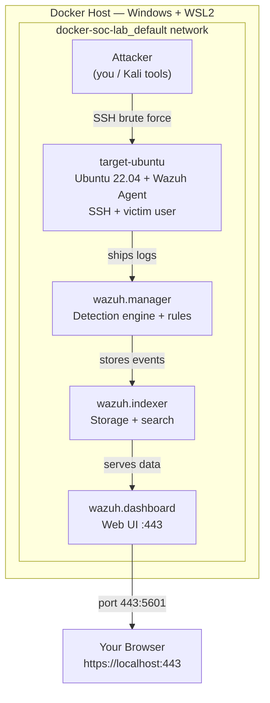

# Docker SOC Detection Lab — Wazuh SIEM

A fully containerized Security Operations Center (SOC) lab built with Docker. It runs a
complete **Wazuh SIEM** stack, ingests logs from a target machine via a Wazuh agent,
and is used to **simulate attacks and detect them** end to end — the core workflow of a
SOC analyst.

Everything is reproducible: one set of commands stands up the entire environment from
scratch. No secrets or certificates are committed — they are generated locally.

---

## What this lab demonstrates

- Standing up a real SIEM (Wazuh: indexer + manager + dashboard) using Docker Compose
- Deploying a **Wazuh agent** on a target host to ship logs to the manager
- Simulating an attack (SSH brute force) against the target
- **Detecting** that attack in the SIEM and viewing the alerts
- Writing and tuning a **custom detection rule**
- Mapping detections to **MITRE ATT&CK**

---

## Architecture



### The four containers

| Container | Role | Analogy |
|---|---|---|
| **wazuh.indexer** | Stores and searches all log/event data (OpenSearch-based) | The archive / search engine |
| **wazuh.manager** | Analyzes incoming logs against detection rules, raises alerts | The detection brain |
| **wazuh.dashboard** | Web UI for viewing alerts, agents, and MITRE mapping | The SOC monitoring screen |
| **target-ubuntu** | A monitored "employee" host running a Wazuh agent + SSH | The endpoint being watched |

Containers vs VMs: unlike a full virtual machine (which runs an entire guest OS), these
containers share the host kernel and package only what each service needs — so the whole
stack is lightweight and boots in seconds while staying isolated on a private network.

---

## Prerequisites

- **Docker Desktop** (with WSL2 backend on Windows)
- **~4 GB RAM free** for the stack
- A browser

### One-time kernel setting (Windows/WSL)

The Wazuh indexer (OpenSearch) requires a raised `vm.max_map_count`. Docker restarts reset
this, so re-run it if the indexer fails to start:

```bash
wsl -d docker-desktop sysctl -w vm.max_map_count=262144
```

---

## Setup

### 1. Generate certificates (one-time, local only)

Certificates are **not** committed to this repo — you generate your own:

```bash
docker-compose -f generate-indexer-certs.yml run --rm generator
```

### 2. Start the Wazuh stack

```bash
docker-compose up -d
```

Wait 2–3 minutes for the indexer to fully initialize.

### 3. Log in to the dashboard

Open **https://localhost:443** and accept the self-signed certificate warning
(expected — it is your own local cert).

| Field | Value |
|---|---|
| Username | `admin` |
| Password | `SecretPassword` |

> **Security note:** these are Wazuh's default lab credentials. In any real deployment
> they must be rotated immediately — shipping default credentials is a classic security
> failure (and something a SOC analyst is expected to catch).

### 4. Deploy the target host + agent

```bash
docker-compose -f agent.yml up -d
docker logs -f target-ubuntu     # watch it install the agent (2–4 min)
```

Confirm the agent registered:

```bash
docker exec target-ubuntu /var/ossec/bin/wazuh-control status
```

The `target-ubuntu` agent should now appear as **Active** under **Agents** in the dashboard.

---

## Running an attack (SSH brute force)

From the host, hammer the target's SSH with wrong passwords to simulate a brute-force
attempt against the `victim` account:

```bash
# example using hydra from a tools container or the host
# (repeated failed SSH logins against target-ubuntu)
```

> Attack commands are run against the lab's own `victim` user for detection testing only.

In the dashboard, open **Threat Hunting / Security Events** and filter for the target.
You should see **multiple authentication-failure events** correlated into a
brute-force alert.

---

## Detection

Wazuh ships with rules that flag repeated SSH authentication failures. This lab extends
that with a **custom rule** to tune severity and add context. Custom rules live in:

```
config/wazuh_cluster/   (manager rule directory, mounted into the container)
```

Each detection is mapped to its **MITRE ATT&CK** technique — e.g. SSH brute force →
**T1110 (Brute Force)** — which the dashboard surfaces automatically.

---

## Project structure

```
docker-soc-lab/
├── docker-compose.yml            # the Wazuh stack (indexer, manager, dashboard)
├── agent.yml                     # the target-ubuntu host + Wazuh agent
├── generate-indexer-certs.yml    # one-time certificate generator
├── config/                       # Wazuh + indexer configuration
│   └── wazuh_indexer_ssl_certs/  # generated locally, gitignored (NOT committed)
└── README.md
```

---

## Security hygiene

- **No certificates or private keys are committed.** They are generated locally via
  `generate-indexer-certs.yml` and excluded through `.gitignore`.
- Default credentials are used **for lab purposes only** and would be rotated in production.
- The lab runs on an isolated Docker network; the only exposed port is the dashboard (443).

---

## Roadmap

- [ ] Add custom Sigma rules and convert to Wazuh format
- [ ] Expand attack coverage (port scans, privilege escalation, web attacks)
- [ ] Full MITRE ATT&CK technique mapping per detection
- [ ] Automated attack scripts for repeatable testing

---

## Author

**Raghav Mahajan** — Cybersecurity Analyst (Blue Team / SOC)
GitHub: [github.com/HomeLab-Raghav](https://github.com/HomeLab-Raghav) · Portfolio: [raghv.dev](https://raghv.dev)
