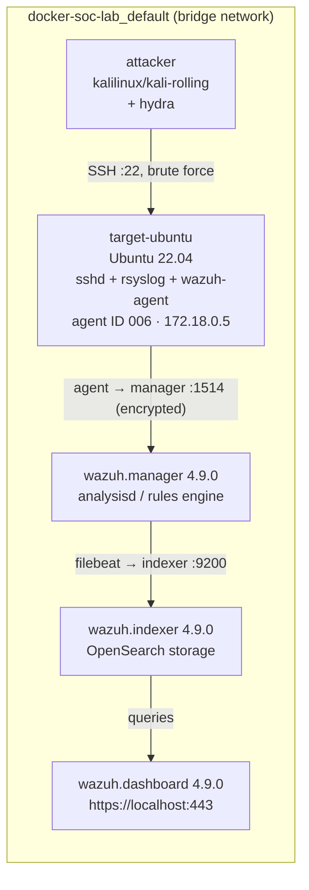

# Incident Response Report — Hydra SSH Brute-Force Lab #1

| Field | Value |
|---|---|
| **Report ID** | HYDRA-LAB-1 |
| **Classification** | Simulated intrusion — controlled lab environment |
| **Environment** | `docker-soc-lab` (Wazuh SIEM stack on Docker Desktop / WSL2) |
| **Target asset** | `target-ubuntu` (Wazuh agent ID `006`, IP `172.18.0.5`) |
| **Attacker asset** | `attacker` — `kalilinux/kali-rolling` container |
| **Attack tool** | THC-Hydra |
| **Attack vector** | SSH password brute force against local account `victim` |
| **Detection platform** | Wazuh 4.9.0 (manager + indexer + dashboard) |
| **Primary MITRE technique** | [T1110 — Brute Force](../technologies-used/mitre-attack.md) |
| **Analyst** | Raghav Mahajan |
| **Report date** | 2026-07-19 |

---

## 1. Summary

This report documents a self-directed, authorized SSH brute-force exercise run against a
purpose-built target inside the `docker-soc-lab` environment. The goal was to generate a
realistic credential-guessing attack and validate that the Wazuh SIEM stack correctly
ingested, decoded, and alerted on it end to end — from raw `sshd`/PAM log lines on the
target container, through the Wazuh agent and manager, into the indexer, and finally
surfaced as readable alerts in the dashboard.

**Outcome:** The attack succeeded — Hydra recovered the valid credential
`victim:password123` — and Wazuh detected it. The manager raised 11 distinct
authentication-failure events and 2 authentication-success events for agent `006` inside
a single burst lasting **under 7 seconds** (13:37:41–13:37:48 UTC), all correctly grouped
under the `sshd`, `pam`, and `authentication_failed` rule groups and mapped to
**MITRE ATT&CK T1110 (Brute Force)**.

This confirms the detection pipeline works, but also confirms an important finding
(see [§6 Findings](#6-findings)): the *default* Wazuh ruleset logged every individual
failure correctly but did **not** escalate this burst into a single high-severity
"brute force detected" correlation alert, because the attack volume (8 password guesses)
fell under the built-in frequency threshold (8 events / 120–180s) for the correlation
rules that exist specifically for this purpose (`5551`, `5712`, `5720`). That gap is the
main lesson of this lab and is addressed in [§8 Remediation](#8-remediation--lessons-learned).

---

## 2. Environment



| Component | Detail |
|---|---|
| Host OS | Windows 11 + Docker Desktop (WSL2 backend) |
| SIEM stack | `docker-compose.yml` — `wazuh.manager`, `wazuh.indexer`, `wazuh.dashboard`, all `4.9.0` |
| Target container | `agent.yml` — `ubuntu:22.04`, hostname `target-ubuntu`, provisioned with `openssh-server`, `rsyslog`, and the Wazuh agent (`wazuh-agent_4.9.0-1_amd64.deb`) |
| Target account | `victim`, password `password123`, created by the container's bootstrap script (`useradd -m -s /bin/bash victim && echo 'victim:password123' | chpasswd`) |
| Log shipping | `sshd` and PAM write to `/var/log/auth.log` via `rsyslogd` (the minimal container has no systemd/journald); the agent's `ossec.conf` tails that file with `<log_format>syslog</log_format>` |
| Attacker container | Ephemeral `kalilinux/kali-rolling` container, `--name attacker`, attached to the **same** `docker-soc-lab_default` network as the target so it can resolve `target-ubuntu` by hostname |
| Dashboard credentials | `admin` / `SecretPassword` (Wazuh default lab credentials — **not** production-safe, see §8) |

Full setup detail: [`technologies-used/wazuh.md`](../technologies-used/wazuh.md) and
[`technologies-used/rsyslog.md`](../technologies-used/rsyslog.md).

### 2.1 Bringing the lab up

Before the attack, the stack was started from a Windows PowerShell terminal:

```powershell
# kernel setting the Wazuh indexer (OpenSearch) requires — Docker restarts reset this
wsl -d docker-desktop sysctl -w vm.max_map_count=262144

# start the Wazuh stack: manager, indexer, dashboard
docker-compose up -d

# start the target machine + its Wazuh agent
docker-compose -f agent.yml up -d

# confirm all 4 containers are Up
docker ps

# confirm the agent registered and is Active on the manager
docker exec docker-soc-lab-wazuh.manager-1 /var/ossec/bin/agent_control -l
```

Output confirmed a healthy manager and a registered, active agent:

```
Wazuh agent_control. List of available agents:
   ID: 000, Name: wazuh.manager (server), IP: 127.0.0.1, Active/Local
   ID: 006, Name: target-ubuntu, IP: any, Active

List of agentless devices:
```


**What happened:** the OpenSearch-based indexer needs `vm.max_map_count=262144` to avoid
mmap failures on startup, so that's set first inside the Docker Desktop WSL2 VM. Two
separate Compose files bring up two independent concerns — the SIEM stack itself
(`docker-compose.yml`) and the monitored endpoint (`agent.yml`) — so the SIEM can be
redeployed without tearing down the target, and vice versa. `agent_control -l` is the
authoritative way to confirm an agent has completed key exchange with the manager and is
actively sending keepalives, rather than trusting container `Up` status alone (a
container can be "Up" while its Wazuh agent service inside has failed to register).

**Why it matters:** if the agent never shows `Active` here, nothing downstream —
detection, alerting, dashboards — will work, because no logs are reaching the manager.
This is the first checkpoint in any Wazuh deployment.

Cross-checked visually in Docker Desktop:


**What happened:** all four `docker-soc-lab` containers (`target-ubuntu`,
`wazuh.dashboard`, `wazuh.indexer`, `wazuh.manager`) show green running-state dots and
active port mappings (`443:5601` for the dashboard, `9200:9200` for the indexer,
`1514:1514`/`1515:1515`/etc. for the manager). Three other unrelated `hello-world`
containers and a Postgres container (`fleet-pg`) are visible from other projects on the
same Docker Desktop instance — confirmed as noise, not part of this lab.

**Why it matters:** a visual, at-a-glance confirmation that the whole stack survived
startup before spending time on the attack — cheaper to catch a crashed container here
than to debug "no alerts are showing up" later and wonder if it's a rule problem or an
infrastructure problem.

---

## 3. Attack Executed

The attack was launched from a **separate, disposable Kali Linux container** rather than
the Windows host, to keep the attack tooling (and its footprint) fully isolated from the
host OS and to mirror how a real external/lateral attacker would only ever touch the
target over the network, never the host directly.

```powershell
docker run -it --rm --name attacker --network docker-soc-lab_default kalilinux/kali-rolling bash
```

Inside the attacker container:

```bash
apt-get update && apt-get install -y hydra

printf 'admin\n123456\npassword\nletmein\nqwerty\nroot\ntoor\npassword123\n' > pwlist.txt

hydra -l victim -P pwlist.txt target-ubuntu ssh -t 4
```


**What happened, step by step:**

1. `docker run -it --rm --name attacker --network docker-soc-lab_default kalilinux/kali-rolling bash` —
   spins up a throwaway Kali container, joins it to the **same Docker bridge network**
   the target is on (`docker-soc-lab_default`), so it can reach `target-ubuntu` by
   container hostname exactly like a machine on the same LAN segment would. `--rm` means
   the container (and any attacker tooling/artifacts inside it) is destroyed the moment
   the shell exits — nothing persists.
2. `apt-get update && apt-get install -y hydra` — Kali's repos don't ship every tool
   pre-installed in the base image, so Hydra (and its ~40 dependency packages, visible in
   the captured output) is pulled fresh.
3. `printf '...' > pwlist.txt` — builds an 8-line wordlist of common weak/default
   passwords: `admin`, `123456`, `password`, `letmein`, `qwerty`, `root`, `toor`, and
   `password123` (the last one is deliberately the real password, so the attack has a
   guaranteed successful outcome to detect).
4. `hydra -l victim -P pwlist.txt target-ubuntu ssh -t 4` — runs Hydra against a single
   known username (`-l victim`) with the password list (`-P pwlist.txt`), targeting the
   `ssh` service on host `target-ubuntu`, using `4` parallel connections (`-t 4`).

**How:** Hydra opens up to 4 concurrent SSH connections to `target-ubuntu:22` and tries
one `victim:<password>` pair per connection, cycling through the wordlist. Because no
`-f`/`-F` "stop on first valid credential" flag was passed, Hydra kept attacking through
the **entire** wordlist even after it found the correct password — which is exactly why
the Wazuh events show a handful of *failed* logins occurring *after* the one successful
login (see [§5 Timeline](#5-timeline)).

**Why:** this reproduces the single most common real-world SSH compromise vector —
automated credential stuffing / password guessing against internet-facing or
lateral-movement-reachable SSH — using the exact tool (Hydra) most commonly seen in the
wild and in offensive-security training for this technique. Full flag reference:
[`technologies-used/hydra.md`](../technologies-used/hydra.md).

---

## 4. Detection

Within seconds, alerts appeared in the Wazuh dashboard's **Threat Hunting** module for
agent `target-ubuntu (006)`:


**What happened:** the dashboard's summary tiles show **20 total alerts** for the agent
in the selected 24-hour window, of which **11 are tagged `authentication_failure`** and
**2 are tagged `authentication_success`** (the remaining 7 are startup/`ossec`/`syslog`/
`sca`/`rootcheck` housekeeping events unrelated to the attack). The "Top 10 Alert groups
evolution" and "Alerts" time-series charts both show a single sharp vertical spike — all
20 events landing in essentially one timestamp bucket — which is itself a strong visual
brute-force signature: real human login activity is spread out; automated tools are not.

**How:** every failed or successful `sshd` login attempt on `target-ubuntu` is written by
`rsyslogd` to `/var/log/auth.log`. The Wazuh agent tails that file, forwards each new line
to `wazuh.manager` over the encrypted agent protocol (port `1514`), where `analysisd`
matches it against the ruleset's regex-based decoders and rules, assigns a severity
level and MITRE mapping, and hands it to Filebeat to ship into `wazuh.indexer`
(OpenSearch) for the dashboard to query.

**Why it matters:** this is the detection pipeline working exactly as designed — raw
text log lines on a remote host become structured, searchable, classified security
alerts with zero manual intervention, within seconds of the event occurring.

Drilling into **Events** for the same agent/time window shows the individual alerts that
make up those totals:


**What happened:** the raw alert stream, sorted newest-first, shows the following rule
IDs firing in the attack window:

| Rule ID | Level | Description | Count observed |
|---|---|---|---|
| `5760` | 5 | `sshd: authentication failed` | 7 |
| `5503` | 5 | `PAM: User login failed` | 4 |
| `5715` | 3 | `sshd: authentication success` | 1 |
| `5501` | 3 | `PAM: Login session opened` | 1 |
| `5502` | 3 | `PAM: Login session closed` | 1 |
| `19004` | 7 | `SCA summary: CIS Ubuntu Linux 22.04 LTS Benchmark v1.0.0. Score less than 50%` | 1 (unrelated background scan, 13:33) |

**How:** each rule matches a specific, known log signature. `5760` fires on
`Failed password|Failed keyboard|authentication error` lines from `sshd`; `5503` fires on
PAM's own independent `authentication failure` log line for the same event (PAM and
`sshd` both log a failed attempt, so each Hydra failure produces **two** correlated
alerts, one from each source); `5715` fires on `Accepted password` — the one moment
Hydra's guess of `password123` matched; `5501`/`5502` are the PAM session bracket around
that one successful login (opened, then closed a few milliseconds later — Hydra logs in
just long enough to confirm the credential, then disconnects and moves to the next
guess). Full rule reference: [`technologies-used/wazuh.md`](../technologies-used/wazuh.md).

**Why it matters:** the presence of *both* `5760` and `5503` for the same failed
attempts, plus the `5715`/`5501`/`5502` triplet exactly bracketing the one true
credential, is enough on its own — without even needing a dedicated "brute force"
correlation rule — for an analyst to read the raw event list and reconstruct precisely
what happened and when.

Zooming out to the endpoint-level view for `target-ubuntu` ties the attack into the
broader MITRE ATT&CK and compliance picture Wazuh maintains per agent:


**What happened:** the agent's MITRE ATT&CK panel shows **Credential Access: 11** as the
top tactic by alert count — directly attributable to the brute-force attempts — with
**Lateral Movement: 8** also elevated, since Wazuh's SSH rules dual-map to both
`T1110` (Brute Force, a Credential Access technique) and `T1021.004` (Remote Services:
SSH, a Lateral Movement technique), since a successful SSH login is simultaneously
"credential access achieved" and "a lateral-movement-capable remote session opened." The
PCI DSS compliance donut breaks the same alerts down by PCI DSS requirement IDs
(`10.2.5`, `10.2.4`, `10.6.1`, `2.2`, `10.2.6` — all requirements around logging and
monitoring access to system components), showing this lab's alerts double as compliance
evidence, not just security signal.

**Why it matters:** this is what makes a SIEM different from a plain log aggregator —
the same raw event is automatically classified against multiple frameworks
simultaneously (MITRE ATT&CK for threat modeling, PCI DSS for compliance reporting)
without the analyst doing any manual mapping.

A Configuration Assessment (SCA) scan also ran independently against the target during
the same session, unrelated to the brute-force attack but visible in the same time
window:


**What happened:** the agent's periodic SCA module ran the **CIS Ubuntu Linux 22.04 LTS
Benchmark v1.0.0** policy against `target-ubuntu` and logged individual check results —
e.g. `Ensure password expiration warning days is 7 or more` → `passed`. The endpoint
summary view (image 6) shows the aggregate result: **72 passed / 98 failed / 12 not
applicable**, a compliance score of **42%**, which is what triggered alert `19004` in the
table above.

**Why it matters:** SCA is a *hardening baseline* check, independent of the live attack
detection — it answers "is this host configured securely?" rather than "is this host
being attacked right now?" A 42% CIS score on the target is itself a finding: a
minimally-provisioned Ubuntu container built only to run `sshd` fails the majority of a
real hardening benchmark, which is realistic and worth noting for anyone using this
image as a stand-in for a production host.

---

## 5. Timeline

All times are from the Wazuh alert `timestamp` field (host/container local time,
2026-07-19). Reconstructed in chronological order from the events table:

| Time | Event | Rule ID | Level | Notes |
|---|---|---|---|---|
| 13:33:10 | SCA scan completes on `target-ubuntu` | — | — | Background CIS benchmark scan, unrelated to attack |
| 13:33:24.576 | `SCA summary: score less than 50% (42%)` | `19004` | 7 | Scan result alert |
| 13:37:41.279 | `PAM: User login failed` ×4 (same millisecond batch) | `5503` | 5 | First wave of Hydra's 4 parallel (`-t 4`) connection attempts |
| 13:37:43.235–13:37:43.240 | `sshd: authentication failed` ×4 | `5760` | 5 | Corresponding `sshd`-side failure logs for the same attempts |
| 13:37:45.237 | `sshd: authentication success` | `5715` | 3 | Hydra's guess of `password123` succeeds |
| 13:37:45.237 | `PAM: Login session opened` | `5501` | 3 | Session bracket start for the successful login |
| 13:37:45.244 | `PAM: Login session closed` | `5502` | 3 | Session closes ~7ms later — Hydra disconnects immediately after confirming the credential |
| 13:37:47.238–13:37:47.281 | `sshd: authentication failed` ×3 | `5760` | 5 | Hydra continues through the remaining wordlist entries after the confirmed hit (no `-f`/`-F` flag was used) |

**Total attack duration: ~6.5 seconds** from first failed attempt to last, with the
correct credential found roughly **4 seconds** into the run.

---

## 6. Findings

1. **Detection pipeline is fully functional end-to-end.** Raw `auth.log` lines on the
   target were decoded, classified, and alerted correctly with no rule authoring or
   tuning required — Wazuh's default `sshd_rules.xml` and `pam_rules.xml` handled this
   attack out of the box.

2. **Every individual event was correctly classified**, including the subtle detail that
   Hydra kept attacking *after* finding the valid credential — visible directly in the
   alert timeline without needing packet captures or shell history.

3. **No single "brute force detected" correlation alert fired.** Wazuh ships dedicated
   frequency-based correlation rules for exactly this scenario — `5551`
   ("PAM: Multiple failed logins in a small period of time," level 10, threshold 8
   events/180s) and the `sshd`-side equivalents `5712`/`5720` (threshold 8 events/120s).
   This lab's 8-entry password list produced only 4 `5503` and 7 `5760` events — under
   each rule's independent 8-event threshold — so neither correlation rule crossed its
   trigger point, even though a human analyst reading the raw alert list can immediately
   see this was a brute-force attack. **A larger wordlist (10+ entries) against the same
   target would very likely cross this threshold and raise a level-10 alert.**

4. **MITRE ATT&CK mapping worked automatically and multi-dimensionally** — the same
   alerts were tagged with both `T1110` (Brute Force / Credential Access) and
   `T1021.004` (Remote Services: SSH / Lateral Movement) without any custom rule work.

5. **The target's CIS hardening score (42%) is realistically low** for a
   minimally-provisioned container, which is expected for a from-scratch `ubuntu:22.04`
   image with only `sshd`, `rsyslog`, and the Wazuh agent installed — but is a good
   reminder that a monitored host is not the same thing as a hardened host.

---

## 7. MITRE ATT&CK Mapping

| Technique | Sub-technique | Name | Tactic | Evidence in this lab |
|---|---|---|---|---|
| **T1110** | .001 | Brute Force: Password Guessing | Credential Access | Hydra iterating a static password list against a single known username (`victim`) — alerts `5760`, `5503`, `5710`-family |
| **T1021** | .004 | Remote Services: SSH | Lateral Movement | The one successful `sshd: authentication success` (`5715`) constitutes an attacker-controlled interactive SSH session on the target |
| **T1078** | — | Valid Accounts | Defense Evasion / Persistence / Privilege Escalation / Initial Access | Once cracked, `victim:password123` is now a valid, unrevoked credential an attacker could reuse |

Full technique writeup: [`technologies-used/mitre-attack.md`](../technologies-used/mitre-attack.md).

---

## 8. Remediation / Lessons Learned

**For the target account (`victim`):**
- `password123` is a trivially weak, dictionary-guessable password recovered in under
  4 seconds by an 8-entry wordlist. In any real environment this account should be
  disabled or have its password rotated to something meeting a real complexity/length
  policy immediately.
- Enforce SSH key-based authentication and disable `PasswordAuthentication` in
  `sshd_config` entirely — the single highest-impact fix against this entire attack
  class. See [`technologies-used/ssh.md`](../technologies-used/ssh.md) §Hardening.

**For detection tuning (the main finding of this lab):**
- The built-in correlation rules (`5551`, `5712`, `5720`) use an 8-events-per-
  120–180-second frequency threshold, calibrated for noisier, slower real-world
  attacks. A fast, low-volume wordlist attack like this one can complete *before*
  crossing that threshold. Consider a custom lower-threshold rule (e.g. 4 events/60s)
  scoped to this lab's target group for more sensitive brute-force correlation, or rely
  on the individual `5760`/`5503` alerts plus a dashboard visualization/alert on *any*
  `authentication_failure` burst regardless of correlation-rule status.
- Add an **active response** binding (e.g. `firewall-drop`) to rule `5551`/`5712`/`5720`
  so that if/when the correlation threshold *is* crossed, the offending source IP is
  automatically blocked — turning detection into containment.

**For the environment generally:**
- Rotate the Wazuh dashboard's default lab credentials (`admin`/`SecretPassword`) before
  any non-lab use — shipping default credentials is itself a classic security failure.
- The target's 42% CIS benchmark score is a reminder to pair detection labs like this
  one with a hardening pass — a monitored-but-unhardened host still gets compromised,
  it's just compromised *loudly* instead of silently.

**For future lab iterations:**
- Re-run with a wordlist ≥10 entries to observe the `5551`/`5712`/`5720` correlation
  rules actually fire, and capture that alert for comparison.
- Add `-f` to the Hydra command to observe the "stop on first success" behavior and
  compare the resulting (shorter, cleaner) alert timeline.
- Write and test a custom Wazuh rule (`config/wazuh_cluster/`) that specifically
  triggers on the `5760` → `5715` sequence (N failures immediately followed by a
  success for the same user/source) as a "successful brute force" alert distinct from
  Wazuh's generic multi-failure correlation.
