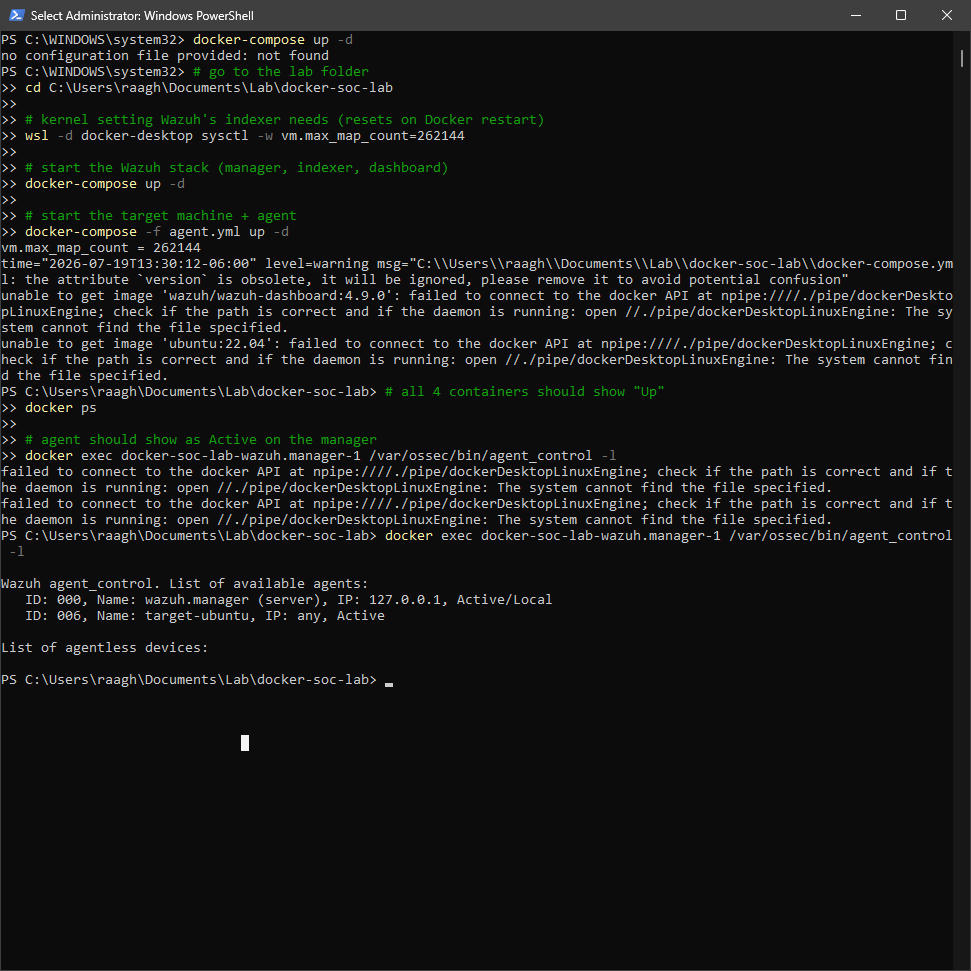
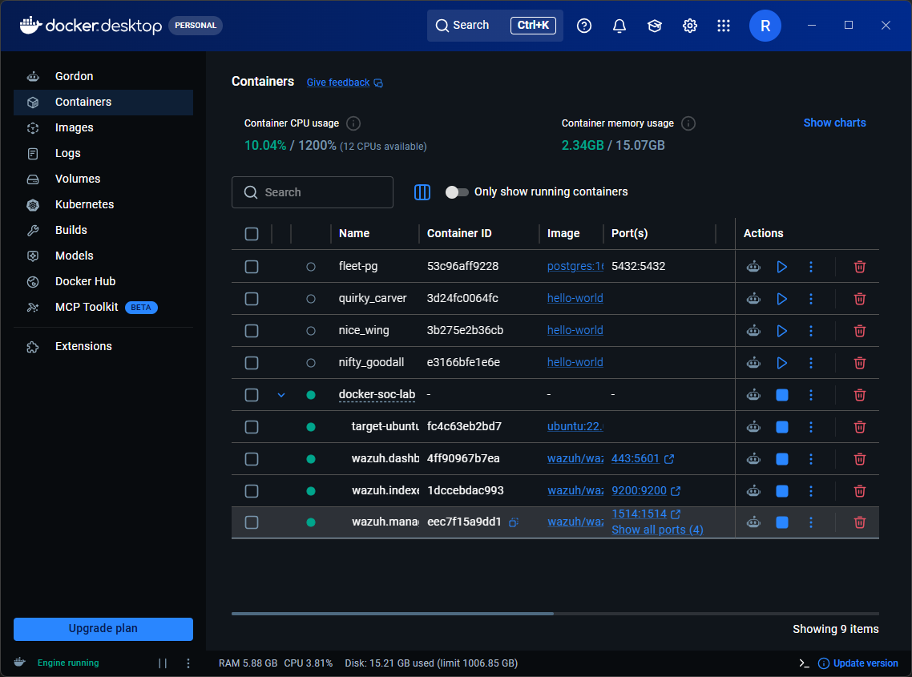
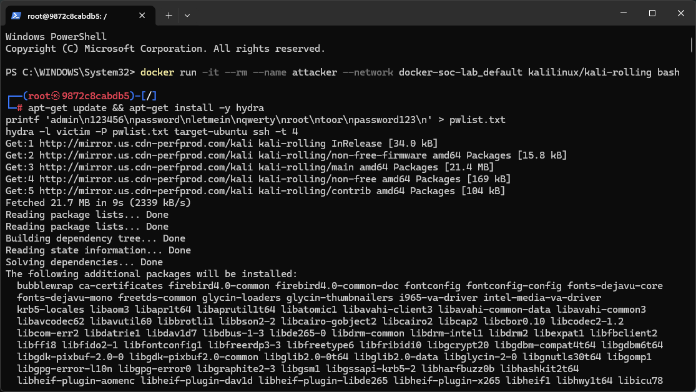
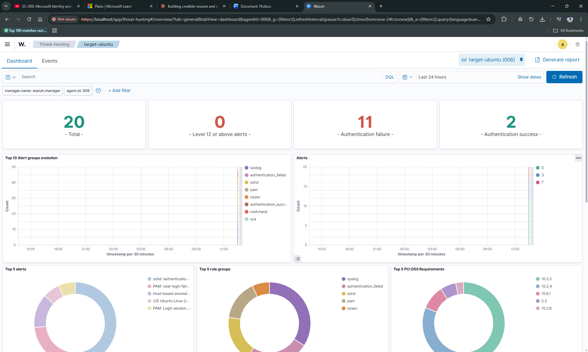
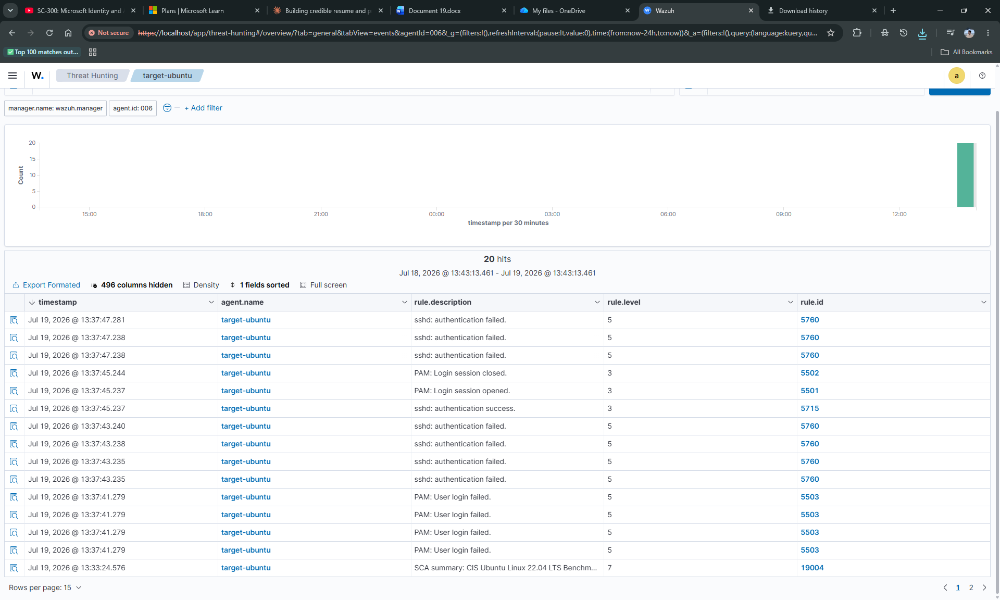
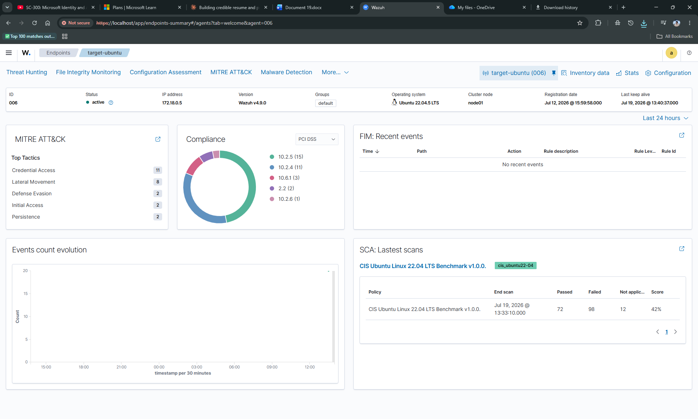
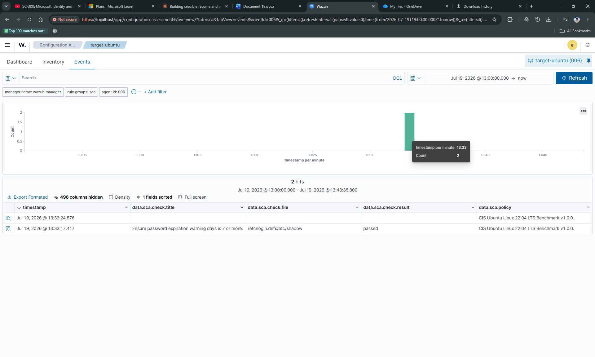

# mllabs — Hydra Brute-Force Lab, Visual Walkthrough

A screenshot-by-screenshot narrative of the Hydra SSH brute-force lab, in the order the
actions actually happened. Where the incident report ([`incident-response/hydra-lab-1-report.md`](incident-response/hydra-lab-1-report.md))
is written for a formal audience, this page is the informal "here's the story of what I
did and saw" version — same evidence, told chronologically as a walkthrough.

---

## Scene 1 — Standing up the lab



Before any attack happens, the SIEM has to exist. This is a Windows PowerShell terminal
running the full bring-up sequence for `docker-soc-lab`:

- First, a WSL2 kernel tweak (`vm.max_map_count=262144`) that the Wazuh indexer
  (OpenSearch under the hood) needs to avoid failing on startup — Docker Desktop resets
  this on every restart, so it has to be re-applied each session.
- Then `docker-compose up -d` brings up the three SIEM containers — manager, indexer,
  dashboard.
- Then a *second*, separate compose file — `agent.yml` — brings up just the monitored
  target: an `ubuntu:22.04` container with SSH and a Wazuh agent installed.
- Finally, `agent_control -l` queries the manager directly and confirms the target
  registered successfully: `ID: 006, Name: target-ubuntu, IP: any, Active`.

That last check matters more than it looks — a container can be "running" while the
Wazuh agent *inside* it has failed to connect to the manager. `agent_control -l` is the
only way to be sure the agent itself, not just the container, is healthy before trusting
anything the dashboard shows later.

---

## Scene 2 — Confirming the stack visually



A second, visual confirmation in Docker Desktop itself. All four `docker-soc-lab`
containers show green "running" indicators, with their port mappings visible on the
right — `443:5601` for the dashboard (so `https://localhost:443` reaches the Wazuh UI),
`9200:9200` for the indexer, and the manager's agent-communication ports. A few unrelated
containers from other projects (`hello-world`, `fleet-pg`) sit in the same list — normal
Docker Desktop clutter, not part of this lab.

This is the "everything is green, safe to proceed" checkpoint before touching the
attacker tooling.

---

## Scene 3 — The attack



This is the core of the lab. A disposable Kali container (`--name attacker`) was
launched on the *same* Docker network as the target, so it could reach `target-ubuntu`
by hostname just like a real machine on the same subnet.

Three commands tell the whole story:

```bash
apt-get update && apt-get install -y hydra
printf 'admin\n123456\npassword\nletmein\nqwerty\nroot\ntoor\npassword123\n' > pwlist.txt
hydra -l victim -P pwlist.txt target-ubuntu ssh -t 4
```

Hydra wasn't pre-installed, so it's pulled from Kali's repos first. Then an 8-line
password wordlist is written by hand with `printf` — a mix of classic weak passwords
(`admin`, `123456`, `qwerty`, `letmein`, `root`, `toor`) plus the actual real password
(`password123`) tucked in at the end, guaranteeing the attack succeeds so there's
something real to detect.

The Hydra command itself: attack a **known** username (`-l victim`, one user, not a
list), try **every** password in the file (`-P pwlist.txt`), against the `ssh` service
on host `target-ubuntu`, using `4` parallel connections at once (`-t 4`) to speed things
up. No "stop on success" flag was used, which turns out to matter later — Hydra kept
attacking even after it found the right password.

---

## Scene 4 — The alert summary lights up



Switching to the Wazuh dashboard and opening **Threat Hunting** for `target-ubuntu`, the
attack is immediately visible without searching for anything — the default 24-hour
overview already shows it. **20 total alerts**, **11 tagged as authentication failures**,
**2 as authentication successes**. The time-series charts (`Top 10 Alert groups
evolution` and `Alerts`) both show one sharp vertical spike instead of any spread-out
activity — which is itself the visual signature of automated, scripted brute-forcing as
opposed to a human typing passwords one at a time.

The `Top 5 rule groups` donut breaks it down further: `syslog`, `authentication_failed`,
`sshd`, `pam`, `ossec` — confirming both the `sshd` daemon and Linux's PAM
authentication layer independently logged the attack, which is exactly what you'd expect
from a standard `sshd` + PAM login stack.

---

## Scene 5 — Reading the raw alert stream



This is where the story becomes a timeline. Every single alert from the attack is here,
sorted newest-first, all packed into roughly **6.5 seconds** (13:37:41.279 to
13:37:47.281). Reading it bottom-to-top (oldest to newest):

1. A batch of `PAM: User login failed` (rule `5503`) — the first wave of Hydra's four
   parallel connection attempts.
2. A batch of `sshd: authentication failed` (rule `5760`) — the `sshd`-side log of the
   same failed attempts.
3. One `sshd: authentication success` (rule `5715`) — the moment `password123` matched.
4. `PAM: Login session opened` (`5501`) immediately followed, ~7 milliseconds later, by
   `PAM: Login session closed` (`5502`) — Hydra logs in just long enough to confirm the
   password is correct, then immediately disconnects.
5. **More** `sshd: authentication failed` (`5760`) events — because no stop-on-success
   flag was passed to Hydra, it kept working through the rest of the wordlist even after
   already finding the valid credential.

Every detail of the attack — including the very specific behavior of "Hydra doesn't
stop when it wins unless you tell it to" — is fully reconstructable from this table
alone, with no other tooling needed.

---

## Scene 6 — Zooming out: MITRE ATT&CK and compliance



The agent-level summary page ties everything together. Under **MITRE ATT&CK**, the top
tactic by alert count is **Credential Access (11)** — directly the brute-force attempts
— with **Lateral Movement (8)** close behind, because Wazuh's SSH rules map to *both*
`T1110` (Brute Force) and `T1021.004` (Remote Services: SSH) at once: a successful SSH
login is simultaneously credential theft and a foothold for moving further into the
network.

The **PCI DSS compliance** donut shows the same alerts sliced a completely different
way — by which PCI DSS control each one satisfies evidence for (`10.2.5`, `10.2.4`,
`10.6.1`, etc., all related to logging and monitoring access). Same data, two different
lenses, generated automatically.

And tucked in the corner, the **SCA: Latest scans** card shows the target's CIS Ubuntu
22.04 benchmark score: **42%** (72 passed / 98 failed / 12 not applicable) — a reminder
that this container was built minimally, just enough to run `sshd` and get monitored,
and is nowhere close to a hardened host. Being *watched* and being *secure* are two
different properties.

---

## Scene 7 — The compliance scan detail



The last screenshot drills into that 42% score — the **Configuration Assessment**
module's Events tab, filtered to `rule.groups: sca`, showing individual CIS benchmark
check results. This one, `Ensure password expiration warning days is 7 or more`, passed.
Ninety-seven others in the same scan didn't. This scan ran independently of the attack —
it's Wazuh doing continuous hardening verification in the background, unrelated to
whether anyone is actively trying to break in — but it's a useful companion data point
sitting right next to the attack timeline: it tells you not just *that* the host was
attacked, but roughly *how exposed* it was to begin with.

---

## The story, end to end

Stand up a monitored Ubuntu host inside an isolated Docker network → confirm the agent
registered and is healthy → launch a disposable attacker container on the same network →
install Hydra and build a weak-password wordlist → brute-force a known account over SSH
→ watch the SIEM catch every single attempt, correctly classify it via both `sshd` and
PAM logs, map it to MITRE ATT&CK and PCI DSS automatically, and preserve enough detail
in the raw alert stream to reconstruct the entire attack — including the attacker's tool
behavior — after the fact, without ever touching the target host directly.
