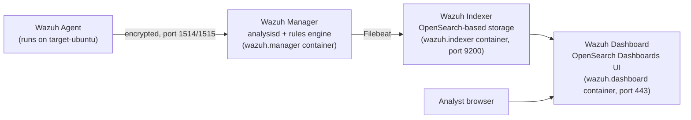

# Wazuh

## What it is

Wazuh is a free, open-source **SIEM (Security Information and Event Management) and
XDR (Extended Detection and Response)** platform. It collects logs and telemetry from
monitored hosts ("agents"), analyzes them against a large, extensible ruleset, raises
classified security alerts, maps them to frameworks like MITRE ATT&CK and PCI DSS/HIPAA/
GDPR/NIST 800-53, and presents everything through a searchable web dashboard. It began
as a fork of OSSEC (a host-based intrusion detection system) and has since grown into a
full SIEM/XDR stack with its own storage and visualization layer.

This entire lab (`docker-soc-lab`) exists to run Wazuh and prove it can detect a real
attack — the Hydra SSH brute force documented in
[`hydra-lab/incident-response/hydra-lab-1-report.md`](../hydra-lab/incident-response/hydra-lab-1-report.md).

## Architecture



| Component | Role | Container in this lab |
|---|---|---|
| **Agent** | A lightweight process installed on the monitored endpoint. Reads local log files, monitors file integrity, runs configuration/vulnerability scans, and forwards everything to the manager over an encrypted, authenticated channel. | Installed inside `target-ubuntu` via `agent.yml`'s bootstrap script |
| **Manager** | The analysis engine. Receives agent data, runs it through decoders (parse raw log text into structured fields) and rules (pattern-match structured fields, assign severity + MITRE mapping), and raises alerts. Also handles agent registration/key management. | `wazuh.manager` — image `wazuh/wazuh-manager:4.9.0` |
| **Indexer** | Storage and search layer, built on **OpenSearch** (an Elasticsearch fork). Alerts and raw events are shipped here by Filebeat (bundled with the manager) for durable storage and fast querying. | `wazuh.indexer` — image `wazuh/wazuh-indexer:4.9.0`, port `9200` |
| **Dashboard** | The web UI — built on **OpenSearch Dashboards** (a Kibana fork) with the Wazuh plugin installed. Provides Threat Hunting, Configuration Assessment, MITRE ATT&CK, and other modules for querying and visualizing indexer data. | `wazuh.dashboard` — image `wazuh/wazuh-dashboard:4.9.0`, exposed on `https://localhost:443` |

All four services (agent role included) run at version **4.9.0** in this lab, defined
across two Compose files: [`docker-compose.yml`](../../docker-compose.yml) (manager,
indexer, dashboard) and [`agent.yml`](../../agent.yml) (target + agent).

### Why two separate Compose files

The SIEM stack (`docker-compose.yml`) and the monitored target (`agent.yml`) are
deliberately decoupled — the SIEM can be redeployed, upgraded, or torn down without
destroying the target's registration state, and multiple different targets could in
principle attach to the same manager by reusing `agent.yml`'s pattern.

## Log flow, end to end

This is the exact path a single `sshd` failed-login line took in this lab, from raw text
to a dashboard alert:

1. **`sshd` writes a log line** on `target-ubuntu`:
   ```
   Jul 19 13:37:43 target-ubuntu sshd[1234]: Failed password for victim from 172.18.0.3 port 51522 ssh2
   ```
2. **`rsyslogd`** (installed and started explicitly in `agent.yml`, since this minimal
   container has no `systemd`/`journald` to own `/dev/log`) writes that line into
   `/var/log/auth.log`. See [`rsyslog.md`](rsyslog.md) for why this step is necessary.
3. The **Wazuh agent**, configured via a `<localfile>` block added to `ossec.conf`
   pointing at `/var/log/auth.log` with `<log_format>syslog</log_format>`, tails the
   file and forwards new lines to the manager over its encrypted channel (TCP `1514`).
4. On the manager, **`analysisd`** runs the line through:
   - A **decoder** (in `sshd_rules.xml`'s companion decoder file) that extracts
     structured fields — `srcip`, `srcuser`, etc. — from the raw text via regex.
   - The **rules engine**, which matches the decoded fields against rule definitions.
     `Failed password` matches rule **`5760`** (level 5, `sshd: authentication failed`,
     mapped to MITRE `T1110.001` and `T1021.004`).
5. The alert (structured JSON, with the original `full_log` preserved) is written to the
   manager's local alert log and simultaneously shipped by **Filebeat** (bundled in the
   manager image) to the **indexer** over its OpenSearch API (port `9200`).
6. The **dashboard** queries the indexer and renders the alert in **Threat Hunting**,
   contributing to the summary tiles, time-series charts, and MITRE/PCI DSS breakdowns
   seen in this lab's screenshots.

Total latency from log line to visible dashboard alert in this lab: effectively
real-time (well under a second in normal operation).

## How detection rules work

Wazuh rules are XML definitions, organized hierarchically — many rules have an
**`if_sid`** (parent rule ID) they extend, letting specific rules inherit a parent's
decoding/matching context and add narrower conditions. A simplified version of rule
`5760` looks like:

```xml
<rule id="5760" level="5">
  <if_sid>5716</if_sid>
  <match>Failed password|Failed keyboard|authentication error</match>
  <description>sshd: authentication failed.</description>
  <mitre>
    <id>T1110.001</id>
    <id>T1021.004</id>
  </mitre>
  <group>authentication_failed,pci_dss_10.2.4,pci_dss_10.2.5,gdpr_IV_35.7.d,gdpr_IV_32.2,hipaa_164.312.b,nist_800_53_AU.14,nist_800_53_AC.7,tsc_CC6.1,tsc_CC6.8,tsc_CC7.2,tsc_CC7.3,</group>
</rule>
```

Key mechanisms the ruleset uses:

- **`<if_sid>`** — this rule only evaluates if its parent rule already matched, letting
  rule files build a tree of increasingly specific conditions instead of re-parsing raw
  text from scratch each time.
- **`<match>` / `<regex>`** — the actual text pattern that must appear (after decoding)
  for the rule to fire.
- **`<frequency>` / `<timeframe>` / `<same_source_ip>`** — the mechanism behind
  **correlation rules**: "fire only if N child-rule matches occur within T seconds from
  the same source." This is how Wazuh detects brute force as a *pattern* over time,
  not just a single bad login.
- **`<group>`** — free-form tags used for both dashboard categorization (`rule.groups`
  in DQL queries — see [`wazuh-query-language.md`](../hydra-lab/wazuh-query-language.md))
  and automatic compliance mapping (`pci_dss_*`, `gdpr_*`, `hipaa_*`, `nist_800_53_*`,
  `tsc_*` tags all live here).
- **`<mitre><id>`** — the mechanism behind automatic MITRE ATT&CK mapping, populating
  `rule.mitre.id` and `rule.mitre.tactic` on every matching alert.

## Rule IDs relevant to this lab

These are the specific rules that fired (or were relevant but *didn't* fire — an
important finding in itself) during the Hydra attack against `target-ubuntu`:

### `sshd` rules (`sshd_rules.xml`)

| Rule ID | Level | Description | MITRE |
|---|---|---|---|
| `5710` | 5 | sshd: attempt to login using a non-existent/invalid user | T1110 |
| `5712` | 10 | sshd: brute force — 8 invalid-user attempts within 120s from the same source (correlation rule, `if_matched_sid` on `5710`) | T1110 |
| `5715` | 3 | sshd: authentication **success** (`Accepted password\|authenticated`) — **fired once in this lab** at 13:37:45, the moment `password123` matched | T1078, T1021 |
| `5716` | 5 | sshd: generic authentication failure pattern (parent of `5760`) | T1110 |
| `5720` | 10 | sshd: authentication-failure brute force from the same source IP (correlation rule) | T1110 |
| `5760` | 5 | sshd: authentication failed (`Failed password\|Failed keyboard\|authentication error`) — **fired 7 times in this lab** | T1110.001, T1021.004 |

### PAM rules (`pam_rules.xml`)

| Rule ID | Level | Description | 
|---|---|---|
| `5501` | 3 | PAM: Login session opened — **fired once**, bracketing the successful login |
| `5502` | 3 | PAM: Login session closed — **fired once**, ~7ms after `5501` |
| `5503` | 5 | PAM: User login failed — **fired 4 times in this lab** |
| `5551` | 10 | PAM: Multiple failed logins in a small period of time — correlation rule, threshold **8 events / 180 seconds** — **did not fire** in this lab, see below |

### SCA rules (`sca_rules.xml`)

| Rule ID | Level | Description |
|---|---|---|
| `19004` | 7 | SCA summary: policy score below 50% — fired once for the CIS Ubuntu 22.04 benchmark scan (42% score) |

### Why the correlation rules (`5551`/`5712`/`5720`) didn't fire

This is the single most important technical finding from this lab (elaborated in the
[incident report](../hydra-lab/incident-response/hydra-lab-1-report.md#6-findings)):
`5551`, `5712`, and `5720` all require **8 matching child events within a 120–180 second
window** from the same source to escalate to a level-10 alert. This lab's 8-entry
wordlist produced only 7 `5760` events and 4 `5503` events — each individually under the
8-event threshold for its respective correlation rule — so no single high-severity
"brute force detected" alert was raised, even though the individual failed/succeeded
events made the attack completely obvious to a human reading the event stream. A longer
wordlist, or a lower custom threshold, would cross this line.

## Configuration Assessment (SCA)

Separately from attack detection, Wazuh's **SCA** module periodically evaluates the
agent's configuration against a hardening benchmark — in this lab, the **CIS Ubuntu
Linux 22.04 LTS Benchmark v1.0.0**. Each individual check (e.g. "Ensure password
expiration warning days is 7 or more") is logged with a `passed`/`failed`/`not
applicable` result; the manager also raises a summary alert (rule `19004` and siblings)
when the aggregate score crosses certain thresholds. This is independent of live
intrusion detection — it answers "how hardened is this host?" rather than "is this host
under attack?" — but both are visible in the same dashboard and agent view.

## Custom rules in this lab's repo

Custom Wazuh rules for this project live in `config/wazuh_cluster/`, mounted into the
manager container, allowing detection logic to be extended (e.g. tuning the correlation
threshold noted above) without modifying Wazuh's shipped ruleset directly.
